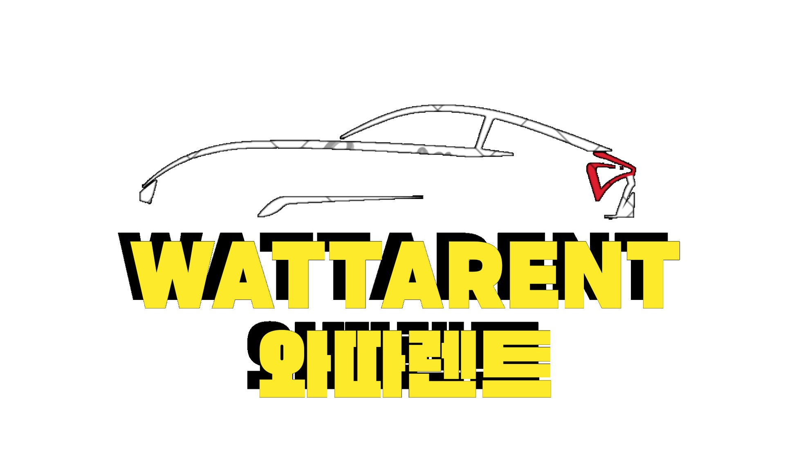
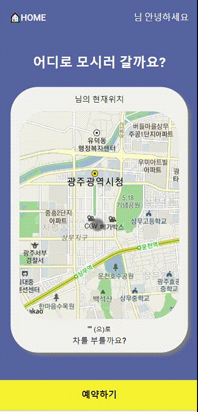
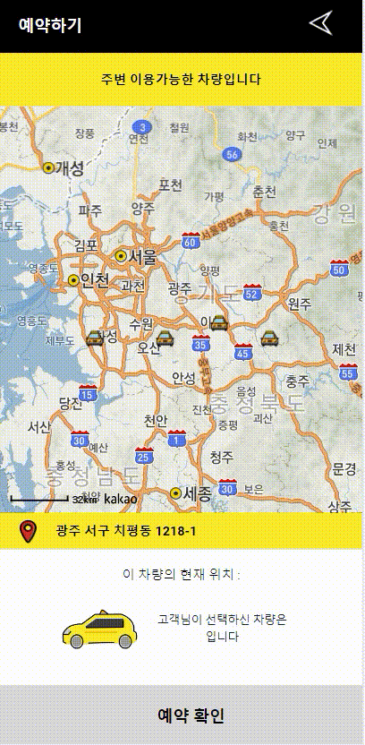
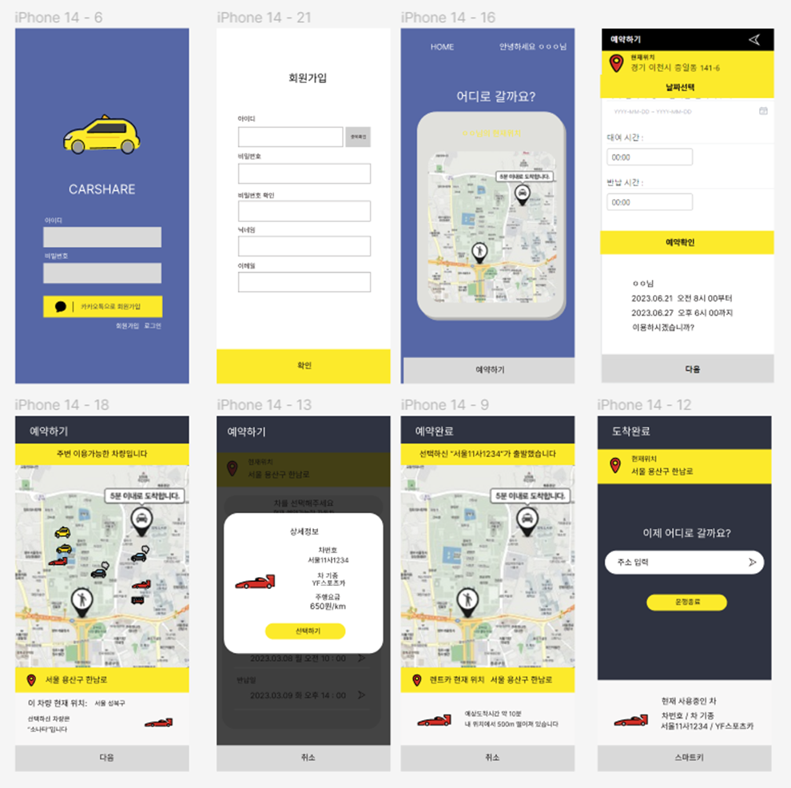
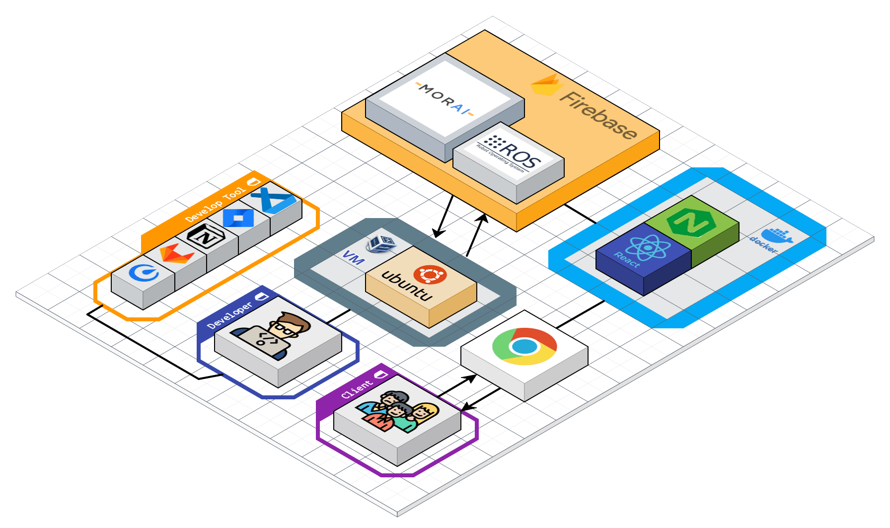
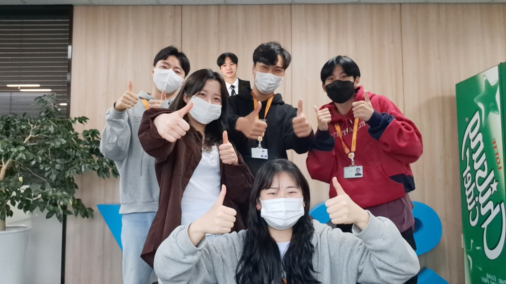

# README.md

---

## 🚘 와따렌트



## 🔴 서비스 소개 [<소개 영상>](https://www.youtube.com/watch?v=zynzqoHcAv4)

```
자율주행 기술 기반 렌터카 서비스
차가 스스로 와따(왔다), 와따(👍)!

자율주행을 기반으로 차량 대여와 반납에 이어 차량 이용에서 편의를 제공하고자 하는 서비스
```

## 🔴 기획 배경

- 코로나19 단계적 일상회복이 이어지며 많은 사람들이 간편한 렌트 서비스를 이용해 여행을 다니는 추세
- 하지만 서비스 이용 시 카센터 또는 정해진 장소로 이동해야 함, 짐이 있는 경우 곤란할 수 있음
- 반납 시에도 마찬가지로 카센터 또는 정해진 장소로 이동해야 함
- 원하는 장소로 부르고 반납하는 서비스가 있지만, 추가 비용이 필요함
- 최근 급부상 중인 자율주행 기술을 활용할 방안 중 한 가지로 자율주행 렌터카 서비스를 기획하게 됨

## 🔴 서비스 기능

1. 회원가입 & 로그인 기능
2. 차량 대여 장소 예약 기능
3. 차량 대여 및 반납 일자 & 시간 예약 기능
4. 대여 장소와 가까운 주변 차량 예약 기능
5. 여행 목적지 설정 및 자율주행 기능
6. 최단거리 이동 (도착지, 목적지 기준)
7. 차량 선택 후 반납까지 모두 자율주행으로 진행
8. 실시간으로 이동하는 차량 위치 웹에서 확인 가능

---

## 1️⃣ 주요 기술 스택

**MiddleWare** : ROS melodic

**Simulator** : MORAI 22.R4.1

**운영체제** : VM - Ubuntu 18.04 ( ROS ), Windows10 ( MORAI )

**DB** : firebase

**FE** : React

---

## 2️⃣ 팀원 소개 및 담당 역할

- **이준호** [팀장] : 자율주행 고도화(인지), 프로젝트 관리
- **여도현** [팀원] : Frontend 개발, Backend 개발
- **이영도** [팀원] : 자율주행(인지) 고도화
- **박현영** [팀원] : Frontend 개발, UCC 제작, PPT 제작
- **조유빈** [팀원] : 자율주행 고도화(판단, 제어), 발표, PPT 제작
- ~~**황채연** [팀장] : 자율주행 고도화(판단, 제어), 프로젝트 총괄~~ (취업)

---

## 3️⃣ Overview 👀

### 1. 회원가입 & 로그인 화면


### 2. 차량 대여 장소 예약 기능



### 3. 차량 대여 및 반납 일자 & 시간 예약 기능


### 4. 대여 장소와 가까운 주변 차량 예약 기능



### 5. 실시간 차량 위치 확인과 알림 서비스


### 6. 자율주행 기능

[광주 SSAFY 특화 자율주행 (와따렌트)](https://youtu.be/zynzqoHcAv4)

---

## 4️⃣ 기대효과 및 발전방향

### 🟠 기대 효과

일단 운전자가 직접 운전을 하지 않아도 되므로 사람이 발생시키는 사고를 방지할 수 있으며, 그로 인해 보험료나 유지 비용이 줄게 되고 궁극적으로 대여 비용을 줄여주게 됩니다. 또한 자율주행이므로 고객들에게 더 많은 시간적 공간적 자유도를 제공합니다.

### 🟠 발전 방향

고객이 선택할 수 있는 최적의 경로 여러 개를 제공하여 경로 선택의 폭을 넓히고 AVNT에 주행 중 여러 가지 영상 스트리밍 (넷플릭스 등) 제공이나 핸드폰 페어링 등으로 고객 편의, 여가 시간 등을 확보합니다.

---

## 5️⃣ Conventions

### 🟢 Commit 관련

```
- 개괄
    - 모든 커밋 메시지는 `영어` 로 작성
- 구조
    - 기본적으로 커밋 메시지는 아래와 같이 제목/본문/꼬리말로 구성
    
    `type : subjectbodyfooter`
    
- 커밋 타입(Type)
    - feat : 새로운 기능 추가
    - fix : 버그 수정
    - docs: 문서 내용 변경
        - 예시
            - "fix" --> ''[BE] fix'
    - study: 공부
    - settings: 환경설정
    - style: 포맷, 세미콜론 수정 등 코드가 아닌 스타일에 관련된 수정
    - refactor: 리팩토링 코드
    - test: 테스트 코드 추가 및 리팩토링 테스트 등
    - chore: build task 수정, 프로젝트 매니저 설정 수정 등
    - 타입은 소문자로 시작
    - 타입은 항상 대괄호 안에 파트를 입력하여 시작
- 제목(Subject)
    - 제목은 50자 이내로, 대문자로 시작하며 모두 소문자로 작성
    - 파일명의 경우에는 대소문자 고려하지 않음
    - 마침표로 끝나지 않도록 함
    - 과거시제를 사용하지 않고 명령어로 작성
    - 예시
        - "feat : Logined" --> "feat : Login"
        - "feat : Added" --> "feat : Add"
- 본문(Body)
    - 선택사항
    - 부연 설명 필요 시 작성
    - 100자 미만 작성 권장
- 꼬리말(Footer)
    - 선택사항
    - issue tracker id를 작성할 때 사용
    - JIRA Code 작성 시 사용
- 예시
    
    `[FE] feat : Login DEsign.py`
```

### 🟢 **JIRA 관련**

- 월요일에 주 단위로 이슈 생성하기
- 각자 이슈 완료 시키기
- 주에 40시간 이상 이슈 생성

### 🟢 Code 관련

### FE

- var대신 const, let 사용하기
- 가능한 Arrow Function으로 함수식 작성

### BE

- 변수명, 인스턴스명: camelCase
- 상수 변수명(static final): 대문자, 띄어쓰기는 _ 사용
- 클래스명, 생성자명: PascalCase
- 함수명: camelCase(동사 + 명사로 구성)
- Mysql table, column name: snake_case

---

## 6️⃣ 와이어 프레임



와이어 프레임 구성

---

## 7️⃣ 아키텍처



아키텍처 구성도

---

## 8️⃣ 회고

[둘째주 회고 (230306 - 230310)](https://www.notion.so/230306-230310-4ba8b198c2714f7caf0de817b91e07ee) 
<br>
[셋째주 회고 (230313 - 230317)](https://www.notion.so/230313-230317-6105e39034e9403d94319974cd7676f6)
<br> 
[넷째주 회고 (230320 - 230324)](https://www.notion.so/230320-230324-0ab0a328bb2c417d882857a089909a5f) 
<br>
[다섯째주 회고 (230327 - 230331)](https://www.notion.so/230327-230331-427c1d9e50ee4f049c4a6369ed90f99f) 
<br>
[여섯째주 회고 (230403 - 230407)](https://www.notion.so/230403-230407-8f9d97b184de4a4889e59c66c8042727) 


---

## 9️⃣ TEAM


