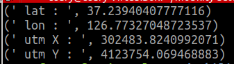

# Today what I do

#### 1. Git, Jira & MatterMost 연동

- MatterMost에 Git, Jira를 연동

- C109_Git, C109_Jira 채널 생성

- 1일 1commit, 백로그 관리에 용이

- 관련 링크: https://pythontoomuchinformation.tistory.com/453

- 관련 자료: jira_git_package.zip

#### 2. Git, Jira Convention

- Git 관리
    - develop branch에서 작업

    - develop > feature 브렌치 생성 후 'feature/기능/이름' 과 같은 방식으로 브렌치 생성

    - CLI
        - git add .
        - git commit -m "[EMB] study : information"
        - git push origin feature/study/chaeyeon

    - 관련 링크: https://www.instagram.com/p/CpJh4RCPhJc/?igshid=YmMyMTA2M2Y%3D

- Jira 관리
    - Epic으로 Frontend, Embedded, 공통 주제로 구분

    - 각각의 역할은 [EMB], [FE] / 공통 역할은 [Common] 과 같이 카테고리 구분

    - 그 뒤에 백로그 내용 기입

    - 그 뒤에 "- 황채연" 과 같이 작성

    - ex) [EMB] PID 설계 - 황채연

#### 3. 특화PJT 명세서

- 판단/제어에 앞서 선행돼야하는 인지에 대한 학습 진행

- Sensor 메세지 GPS - parser
    - gps_parser.py 스켈레톤 코드 작성 및 수행

    - WGS84 좌표계 -> UTM 좌표계로 변환 (구 형태 좌표계 -> 평면 좌표계) 
    
    - 실행법
        - roslaunch 로 브릿지 실행
        - rosrun ssafy_2 gps_parser.py 실행
        - Morai 네트워크 설정, GPS 센서 부착 후 네트워크 설정
        - 실행 결과 
