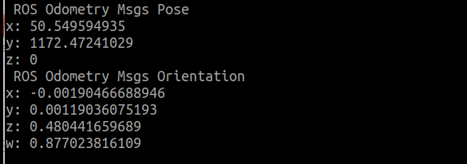
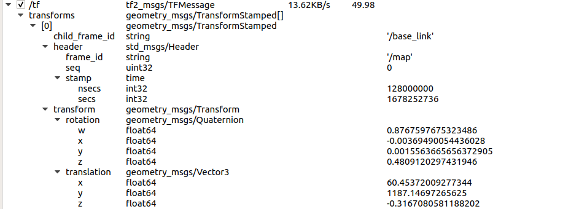

# today what I do

#### 특화 PJT 명세서

##### req 1-2. gpsimu_parser.py

- 시뮬레이터 상에서 받아온 GPS와 IMU 센서 데이터 값 모두 사용

- GPS 데이터 값을 단순 UTM 좌표계로 변환하는 것이 아닌 시뮬레이터에 적용하기 위해서는 UTM으로 변환된 GPS 값에서 오프셋 값을 빼줘야 함

- 시뮬레이터 MAP 기준 좌표계로 변환됨

- 결과화면

##### req 1-3. tf_pub.py

- quaternion_from_euler 함수를 이용하여 시뮬레이터 차량의 좌표를 변환하는 기능을 구현하는 예제

- 시뮬레이터에 기본적으로 TF 기능을 제공하므로 네트워크 설정에서 Publish 기능을 해제

- rqt 에서 tf 창이 뜨는 것을 확인할 수 있음

- 결과화면

