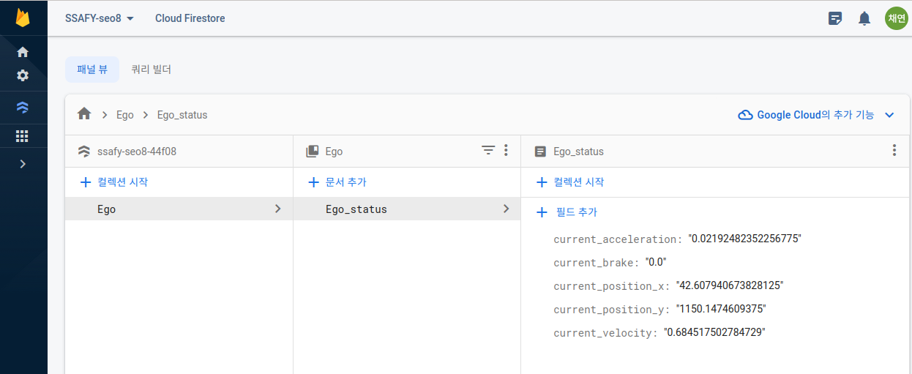

# today what I do

#### 1. trouble shooting

- Simulator to Web(use. firebase)

- ROS 가 python2 버전을 기본으로 사용하기 때문에 python3 버전으로 upgrade
    - pip3 install, pip3로 모듈 다운로드

- roslaunch ~~ 실행 안됨
    - 패키지가 탐색이 안됨
    - catkin_ws 지우고 개발환경 다시 구성
    - 패키지는 src 폴더 안에 넣고 catkin_make 하면 패키지 추가된 것을 확인할 수 있다

#### 2. Simulator to Web 실행

- 실행 코드
    - rosbridge 실행 후 네트워크 연결
    - rosrun chapter8 firebase_get_Ego_status.py

- 결과 화면
   - Morai 상에서 Ego vehicle의 위치가 변할 때 마다 값이 변경됨을 확인할 수 있음
   

 

